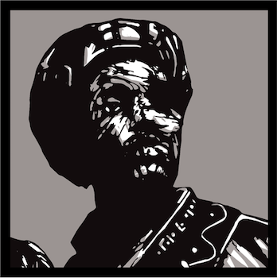

Each year The Ramanan Sivaranjan Awards for Excellence in Gaming highlight gaming books that are exceptional in their quality and character. To qualify for contention a book must have been purchased by Ramanan Sivaranjan during the proceeding calendar year—i.e. the awards given in the summer of 2016 are for books published from January 2015 - December 2015. Winners are chosen by Ramanan Sivaranjan based on his moods about gaming at a particular moment in time. The Ramanan Sivaranjan Awards for Excellence in Gaming prides itself on selecting the finest RPG books. Previous winners have gone on to win at the EN World Awards, 3 Castles, Indiecade, the Indie-RPG Awards, and The Ramanan Sivaranjan Awards for Excellence in Gaming. The first awards were given in the summer of 2015. They originated because Ramanan Sivaranjan found it incredulous that *Death Frost Doom* wasn't nominated for Best Art at the Ennies—like, why even have an award?

# [2017](/blog/awards-2016)

* The Ramanan Sivaranjan Excellence in Gaming Best God Damn Book of 2016: Patrick Stuart & Zak Smith for [Maze of the Blue Medusa][motbm]
* Best Setting Book: Rafael Chandler for [World of the Lost][wotl]
* Best Art: Jeremy Duncan for [Towers Two][tt]
* Honorable Mentions:
  * D. Vincent Baker & Meguey Baker, [Apocalypse World 2e][aw]
  * David Black, [The Black Hack][bh]
  * Kiel Chenier, [Blood in the Chocolate][bitc]
  * Jeff Rients and Ian Maclean, [Broodmother Sky Fortress][bmsf]
  * James Maliszewski and Jez Gordon, [The Cursed Chateau][cc]
  * Cecil Howe, [Do not let us Die in this Cold Winter][cw]
  * Cecil Howe, [HexKit][hk]

# [2016](/blog/awards-2015/)

* The Ramanan Sivaranjan Excellence in Gaming Best God Damn Book of 2015: Scrap Princess and Patrick Stuart for [*Fire on the Velvet Horizon*][fotvh-buy]
* Best Not D&D: Jason Lutes for [*The Perilous Wilds*][pw-buy]
* Best Setting Book:  David McGrogan for [*Yoon-Suin: The Purple Lands*][ys-buy]
* Honorable Mentions:
  * Paolo Greco, [*The Chthonic Codex*][tcc]
  * Pearce Shea, [*In the Woods*][inw]
  * Kiel Chenier, [*The Hell House Beckons*][thhb]
  * Marshall Miller, [*The Warren*][tw]
  * Atsuhiro Okada, [*Ryuutama*][ryu]
  * Mateo Diaz Torres, [*A Pernicious Pamphlet*][app]

# [2015](/blog/awards-2014/)

* The Ramanan Sivaranjan Excellence in Gaming Best God Damn Book of 2014: Zak S, [A Red and Pleasant Land][rapl-buy].
* Best Writing: Patrick Stuart, [Deep Carbon Observatory][dco-buy]
* Best Art: Jez Gordon, [Death Frost Doom][dfd-buy]
* Honorable Mentions:
  * Zzarchov Kowolski, [*Scenic Dunnsmouth*][sd]
  * Kelvin Green, [*Forgive Us*][fu]
  * Johnstone Metzger, [*Evil Wizards in a Cave*][ewc]
  * James Maliszewski, [*The Excellent Traveling Volume*][etv]
  * Brendan S., [*Wonder and Wickedness*][ww]
  * Mike Mearls & Wizards of the Coast, [*5th Edition Dungeon Master's Guide*][dmg]
  * Thor Olavsrud & Luke Crane, [*Torchbearer*][tb]
  
---
  
<small>The logo for the awards is from a drawing of the Knave of Hearts by Zak Smith taken from *A Red and Pleasant Land*, which Jez Gordon mucked around with to make a big banner for the awards because he's a nice helpful person.</small>

[dco-buy]: http://www.rpgnow.com/product/131801/Deep-Carbon-Observatory
[dfd-buy]: http://www.lotfp.com/store/DeathFrostDoom
[rapl-buy]: http://www.lotfp.com/store/index.php?route=product/product&product_id=190
[sd]: http://www.lotfp.com/store/index.php?route=product/product&product_id=181
[ewc]: http://www.drivethrurpg.com/product/119066/RK2-Evil-Wizards-in-a-Cave
[etv]: http://grognardia.blogspot.ca/p/blog-page.html
[ww]: http://www.rpgnow.com/product/145647/Wonder--Wickedness
[dmg]: http://www.amazon.com/Dungeon-Masters-Guide-Core-Rulebook/dp/0786965622
[tb]: https://www.burningwheel.com/store/index.php/torchbearer.html
[fu]: http://www.lotfp.com/store/index.php?route=product/product&product_id=179

[fotvh-buy]: http://www.lulu.com/shop/scrap-princess-and-patrick-stuart/fire-on-the-velvet-horizon/paperback/product-22608214.html
[pw-buy]: http://www.drivethrurpg.com/product/156979/The-Perilous-Wilds
[ys-buy]: http://www.lulu.com/ca/en/shop/david-mcgrogan/yoon-suin/paperback/product-22070778.html
[tcc]: http://www.drivethrurpg.com/product/166076/Chthonic-Codex
[inw]: https://gumroad.com/l/fWSrw
[thhb]: https://dungeonsanddonuts.itch.io/the-hell-house-beckons
[tw]: http://bullypulpitgames.com/games/the-warren/
[ryu]: http://kotohi.com/ryuutama/
[app]: https://gumroad.com/gloomtrain

[tt]: http://www.lotfp.com/store/index.php?route=product/product&path=42&product_id=230
[wotl]: http://www.drivethrurpg.com/product/175129/World-of-the-Lost
[motbm]: http://www.drivethrurpg.com/product/195785/Maze-of-the-Blue-Medusa-o-Deluxe-PDF
[aw]: http://apocalypse-world.com
[bh]: http://www.drivethrurpg.com/product/178359/The-Black-Hack
[bitc]: http://www.lotfp.com/store/index.php?route=product/product&path=42&product_id=237
[bmsf]: http://www.lotfp.com/store/index.php?route=product/product&path=42&product_id=236
[cc]: http://www.lotfp.com/store/index.php?route=product/product&path=42&product_id=233
[cw]: http://www.drivethrurpg.com/product/198895/Do-Not-Let-Us-Die-In-The-Dark-Night-Of-This-Cold-Winter
[hk]: http://www.hex-kit.com