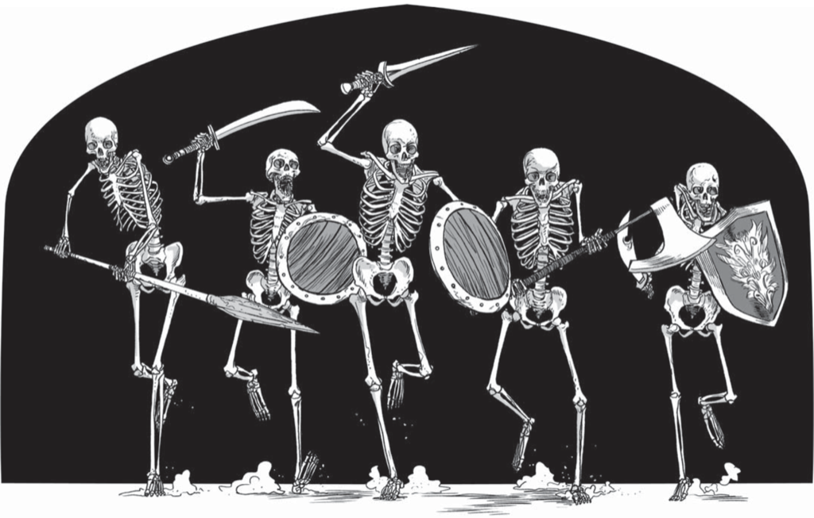

## Players

* Myfanwy
* Durin
* Lars
* Vulko

## Session 1 May 5th, 2022

* Myfanwy, Durin, Lars, and Vulko set off on adventure!
* Hills, Ruins, a Magnificent Tree!
* Circumnavigate the ruins, making our way towards the tree.
* A person hiding in the ruins?
* Myfanwy investigates: it's dim inside, maybe runes on the wall, but no sign of the person.
* We march on towards the tree!
* Vulko will lead the way, despite not knowing anything about pathfinding.[PATHFINDER test, Vulko uses his FOOLHARDY trait for -1D, and fails the test]
* We make some noise, but make it all the way there.
* Huge raptor flies down, and it scoops Vulko up, but they have their staff in hand!
* "I regret nothing!"

## Session 2 May 12th, 2022

* Around the tree are bones, bleached by the sun.
* That's when we hear a screech from above, and a gigantic bird blocks our view.
* Vulko snatched up, but smacks the bird squarely in the neck before he's carried away too far. He lands with surprising grace. [FIGHTER test, +2D from Trait, +1D from Fresh. 6 success. Raptor rolls 2 successes.]
* The group tries to scare away the bird, making loud noises and swinging their weapons about.
* A conflict ensues! [DRIVE OFF, Disposition 9 vs. Disposition 6]
* Myfanwy maneuvers into position to draw the bird to her. Seemingly it works, the bird swoops down to attack. Durin moves in to attack with his battle axe, with Vulko's aid they weaken the birds resolve. The bird attempts to defend itself, but Vulko continues the combat with further aid from Durin and Myfanwy!
* Durin and the Bird attack one another, but with Vulko's aid the bird is driven off, but the party is quite exhausted.
* Surveying the scene, a nest high above, something glittering perhaps.
* Lars can tell the tree gives off magical energy.
* Myfanwy thought she saw a creature behind the tree, but as Lars walks around the tree trying to understand its nature he encounters nothing. [LOREMASTER test, failed]
* Myfanwy finds some sticky substance on the ground. Silky, like a spider web! And then a spider drops down, knocking her into the pit! She catches a thick spider web before falling to the bottom. [SCOUT test, failed]
* Vulko rushes over to see what's happened, calling out to her! She's fine. Another dead halfling across from her, she fishes a notebook from his desiccated body.
* Durin manages to help her get out with his rope and grappling hook.
* The book is hard to read: "God ... Shrine ...". Will take work and time to understand.
* The group return to the smaller ruin they found earlier.
* Some silk dolls near the entrance way. Almost like a voodoo doll.
* They look like Durin and Vulko! So eerie Lars burns them. 
* A staircase leads down into the dark, which they investigate.
* They find a hole in a wall, it leads off into the darkness. They are about to move on when they hear a sigh. "Samiha?" Vulko stage whispers. "Yes?" she replies.
* The party tells her they are here to rescue her, but she doesn't seem keen to come out!
* Lars demands she comes out! [PERSUADER test, trait against himself, failed]
* She says she's comfortable and won't leave ... Lars hears some hissing at the edge of his hearing!

## Session 3 May 19th, 2022

* A hissing static noise, but we can’t determine where it’s coming from. Everywhere?
* Myfanwy doesn’t like any of this, she wants to get the women and get out of here!
* She squeezes through the hole in the wall.
* A pool of water on the other side, and a walkway cuts across it. At the edge of the torchlight is a statue.
* A young woman lays by the pool, near the hole, her hand in the water. Dressed in shepherd's clothes that now hang loosely on her body. She looks like she’s wasted away. It must be Samiha!
* Vulko clears the hole, widening with the help of Duran and Myfanwy. [LABORER 5 dice vs. OB2, barely passed]
* Their torchers sputter out. Plunged into darkness they can hear the sounds of their breathing, and this strange hissing. Duran lights two more torches for the team.
* They pass the women through the hole.
* It’s likely time to rest! [CAMP!]
* A chill runs through the air! [Camping event]
* Vulko is exhausted, and falls asleep deeply knowing Durin is on watch. [RECOVERY 6 vs. OB3. Success, barely.]
* Durin draws him map 
* They leave Samiha behind, and move through the hole to explore further. It’s still quite cold and chilling. 
* The party can see bones beneath the water. Some large swims, they catch hints of movement.
* Durin wants to investigate the statue ahead, and the group follows.
* A giant face carved into the wall on the back of the room. Her eyes are green gemstones.
* “One of my favorite pictures is a group of adventurers just like ourselves, prying gemstones from a statue's eyes. It’s a sign!”
* Durin is intrigued, but before he can investigate more deeply, Myfanwy decides to search the statue and the area around it for traps. Vulko holds her torch as she looks. Durin refocuses his efforts to align with her work, looking at the masonry, etc. [SCOUT 3 vs OB2, failed!]
* The thing in the water is a giant carp, which smashes into the path the party crossed, destroying part of it — it was a bridge.
* The group is trapped in the middle of the water!
* Myfanwy, doesn’t panic, but knows now is the time to snatch the gems.
* As one might expect, some disquiet spirits make their presence known. They begin to advance on the party. Ghosts of people that look to have suffered from disease.
* We must banish these creatures! [BANISH, Disposition 6 vs. Disposition 3]
* These creatures shriek at us, but Durin defends us bravely with his dwarvish stoicism, with Vulko bolstering him with his bravado. But he can’t hold them back, he collapses in terror, this sitaution is to incongruent with his understanding of the underworld. [NATURE 6 vs OB3, Failed, 2 damage.]
* Myfanwy attempts to distract, but the fear of losing to these ghosts is too much. [NATURE 3 vs. OB2,, Failed, 4 damage]
* They knock out Myfanwy and Vulko!
* The party awakens some time later, it’s pitch black. We have all our stuff.
