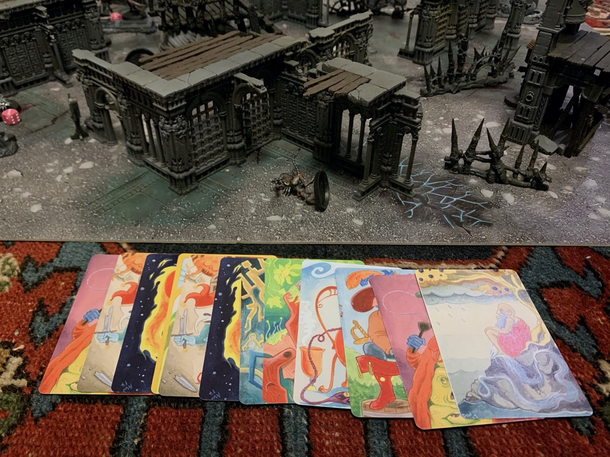

I’ve been helping [Chris][] play test his new Skirmish game [GRIMLITE][] since he started writing it back in May. (I use the terms "helping" and "play test" loosely.) To give the exercise some more meaning I've tried to link my games up into a narrative campaign. I am playing a [Warcry][] campaign with Evan at the moment, and so i've set these solo games on the same planet our games are taking place. I am hoping laying all of this out and sharing how I approach playing will be useful to someone else who wants to get into solo narrative war gaming.

### House Rules

I’m using an initiative system similar to Bolt Action or Troika, instead of the alternating activations rules of GRIMLITE.  Each unit in your warband is assigned a card, as are each type of Horror. You draw a card from the deck and that unit acts. When all the cards are drawn the round ends. This simulates a fog of war, but also makes playing a game where you control all the units a bit more interesting and fun.

I am playing solely with Horrors at the moment, rather than a rival warband I also control. My suggestion if you go this route is to use 6 points of horrors, where a lesser horror is 1 point, and a greater horror is 2. The horrors in their current state vary a fair bit in power, so you will likely need to play around with things to see how your units fare. When you are playing alone I think it's likely more fun or interesting to ratchet up the difficulty of the game, so winning is a real challenge.

Campaigns:
- [Repentia Superior, Sangami, and her squad of battle sisters face of against the newly awoken Necrons of the Kuruva Dynasty][1]

[chris]: https://www.bastionland.com/search/label/GRIMLITE
[grimlite]: https://drive.google.com/file/d/1FF42Wm6j-h_cw2BmTBr0Rir8KHd1rQ9D/view?usp=drivesdk
[warcry]: https://docs.google.com/document/d/1t0DDVkGYf0zExn1fkMrkbcu7rKbrjCId4RQOJlFy0eI/edit
[1]: campaign-1/